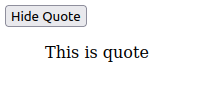

# Quote-Getter

## 👋 About this project
This is a project we created as a template for showing and hiding quotes on any web-site.
***
## 🤔 Why do I need it?
If one needs to include show/hide some quote, some text in their web app, it is an implementation of the feature.
Adapt the code to your needs and use it.
***
## ⚙️ Quick Start
In order to use the project, one needs only a web-browser on their local machine.
1) In order to install the project, one needs to go to the web-page of the project, click on green 'Code' button and choose 'Download ZIP' option.
2) The next step is to open downloaded archive, extract files from it to any directory.
3) To run the program, go to the directory with extracted files, double click on the 'index.html' file.
4) The browser will start, showing one simple 'Get quote' button.
5) If you click on it, the quote will be shown, text on the button switches to 'Hide quote'. Click on it — quote will disappear.
***
## 💡 Features
- ✅ You can show and hide quotes by clicking on the button
- ✅ You can modify and reuse our code in your project
- ✅ This project is written on a pure JavaScript and HTML, there is a full browser support
***
## 🖼️ Demo
First state: 

 
Second state: 

***
## 🌐 Full browser support
Probably this will work with the most browsers, but here is a list which browsers I have tested:

|      Browser      | supported |
|:-----------------:|:---------:|
|      Firefox      |     ✅     |
|      Chrome       |     ✅     |
|        Edge       |     ✅     |
| Internet Explorer |     ✅     |

| Mobile Browser | supported |
|:--------------:|:---------:|
|     Firefox    |     ✅     |
|     Chrome     |     ✅     |
